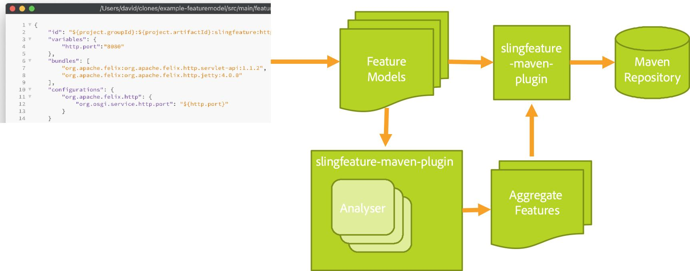
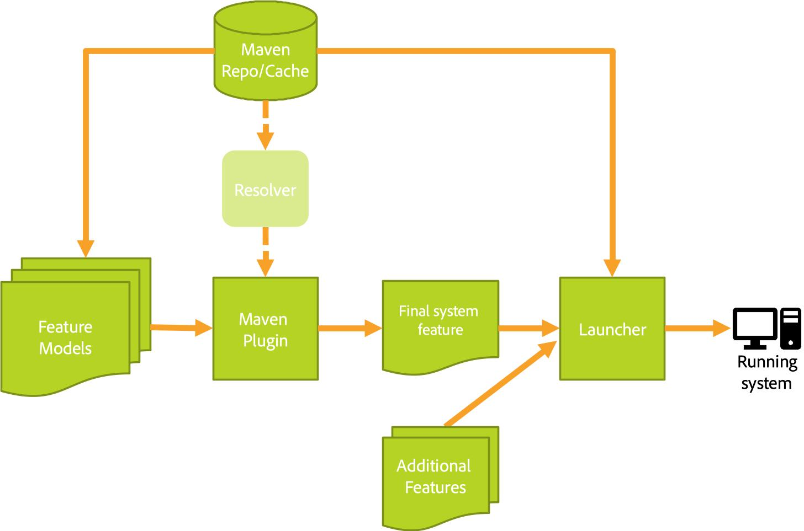

      

# The Sling OSGi Feature Model

OSGi is a platform capable of running large applications for a variety of purposes, including rich client applications,
server-side systems and cloud and container based architectures.

As these applications are generally based on many bundles, describing each bundle individually in the application
definition becomes unwieldy once the number of bundles reaches a certain level. Additionally, OSGi has no mechanism to describe other elements of the application definition, such as configuration or custom artifacts.

While bundles already provide a good way to define rather small, coherent modules, there is often a need to distribute or provision a set of such bundles together with some configuration. Or if you want to build a set of applications (for example microservices) which share certain parts
(like a foundation) the need for a higher level building block arises.

The Sling OSGi Feature Model introduces such a higher level building block to describe OSGi applications or parts of it that encapsulates
the details of the various components that the feature is built up from. It allows the description of an entire OSGi-based application based
on reusable components and includes everything related to this application, including bundles, configuration, framework properties, capabilities,
requirements and custom artifacts.

## Features

In a nutshell, a feature is the central entity for the Feature Model. A feature is described through a JSON object and can contain:
* Metadata like a unique identifier, description etc.
* OSGi bundles
* OSGi configurations
* OSGi Framework properties
* Extensions - a plugin mechanism to add additional information to the feature

Read the [documentation about features](docs/features.md)

## Feature Archives

Feature archives allow to distribute a feature together with all its referenced binaries.

Read the [documentation about feature archives](docs/feature-archives.md)

## Feature Extensions

The Feature Model is extensible, meaning that it can be augmented with custom content in a number of ways. Some extensions are supported out of the box. Other extensions are available through additional modules.

Read the [documentation about available extensions](docs/extensions.md)

# Managing Features

A Feature Launcher can be used to launch features into a running process with an OSGi Framework.
The launcher is typically fed with a number of feature files that should be launched together.
Overrides for variables defined in the feature models can be provided on the launcher commandline.

Tooling exists to analyze and validate features, and to aggregate and merge multiple features into a single
feature, which can be used to create higher level features from a combination of lower-level ones. Most of
the tooling is accessible through the slingfeature-maven-plugin: https://github.com/apache/sling-slingfeature-maven-plugin  

The following diagrams show a typical workflow when working with feature files:

Features are authored as JSON Feature Files.
The slingfeature-maven-plugin provides analyzers and aggregators that check features and can combine them into larger features. The maven plugin can also be used to publish features to a Maven Repository.

To create a running system from a number of feature files, features are selected from a Maven Repository,
they are validated for completeness and optionally additional features are pulled in through the OSGi Resolver
(not yet implemented). A final system feature has no unresolved dependencies. It is passed to the Feature Launcher
along with optional additional features the provide functionality on top of what is defined in the system feature.
The Feature Launcher creates a running process containing an OSGi Framework provisioned with the feature's contents.

## Feature Aggregation

When creating aggregates, extensions are merged into the resulting aggregate feature. There are
default rules for aggregating extension content, which essentially is appending
all the extension content of a given type. However custom merge plugins can also
be provided. After the merge a postprocessor is always run which can perform
additional operations based on the extension content. Note that both the
aggregate task of the `slingfeature-maven-plugin` as well as the launcher perform
merge operations on all the feature models these are provided with.

# Launching

A launcher for feature models is available in this project: https://github.com/apache/sling-org-apache-sling-feature-launcher

# Tooling

The primary tooling around the feature model is provided through Maven by the Sling Feature Maven Plugin: https://github.com/apache/sling-slingfeature-maven-plugin

See the readme of the plugin for more information.  

# References

The links below provide additional information regarding the Feature Model.

* [Requirements](requirements.md)
* [File format](https://github.com/apache/sling-org-apache-sling-feature-io/blob/master/design/feature-model.json)

* [Prototype](prototype.md)
